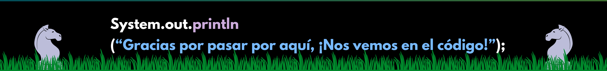

 

<h1 align="center"><b>¡Hola! Soy Camilo</b></h1>

<h3 align="center" >Estudiante de Análisis y Desarrollo de Software. Apasionado por el frontend, explorando el backend y siempre aprendiendo algo nuevo.</h3>

<!--
 -->

<h3>🧑‍💻 Sobre mí</h3>

- 🔭 Me encuentro en formación continua como desarrollador de software.  
- 🌱 Aprendo y practico tanto desarrollo frontend como backend.  
- 💻 Disfruto construir interfaces web con HTML, CSS y JavaScript.
- 🗃️ Profundizo mis conocimientos en bases de datos relacionales, trabajando con sistemas como MySQL y PostgreSQL.

<!--<h3 align="center" > Conecta conmigo 🤝 </h3>-->
<h3 align="center" >⭐Conecta conmigo⭐</h3>

  
  
  
  
  

<h3 align="center">🌞Mi stack tecnológico🌞</h3>

    
    
    
    
    
    
    
    <!---->
    
    

<h3 align="center">📊Mis estadísticas en GitHub📊</h3>

     
    

 
